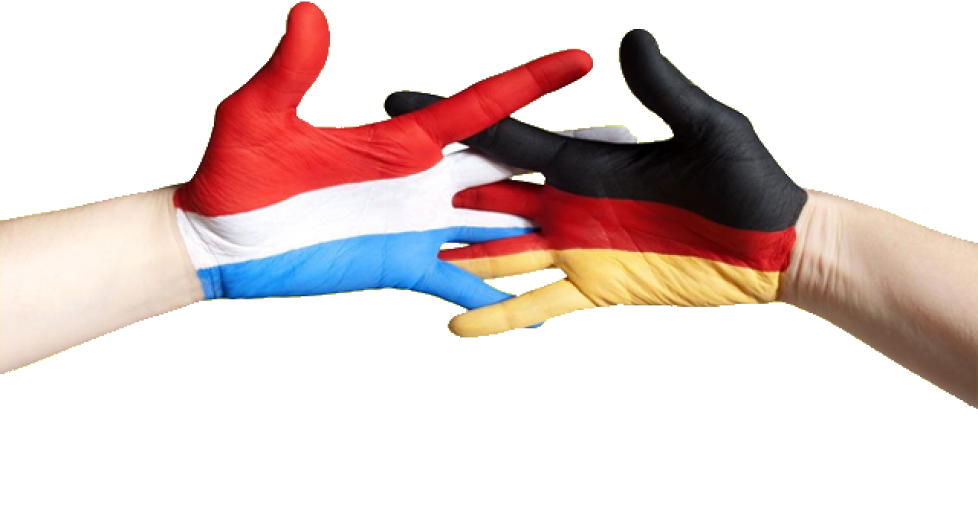

# *Obedience Interland 2024*

Inschrijving open 1 maart 2024  
Anmeldung offen 1 M&auml;rz 2024

## OBB (NL) / OBB (VDH)
## OB1 - OB2 - OB3

via / &uuml;ber

## **www.obedience-interland.nl**

# 14-07-2024

  

Kamperen mogelijk

Camping M&ouml;chlich

 

Startgeld € 20,- inc. ontbijt / Fr&uuml;hst&uuml;ck

 

## Keurmeesters / Leistungsrichter
Monique Barten - Dirk Belder (NL) 
Kirsten Niederstenschee (DE) - Vorbehaltich der Ver&ouml;ffentlichung VHD)

## Stewards
Gerard Tomassen - Barabara Schifter - Edwin Rademakers

  
Info:  info@obedience-interland.nl

